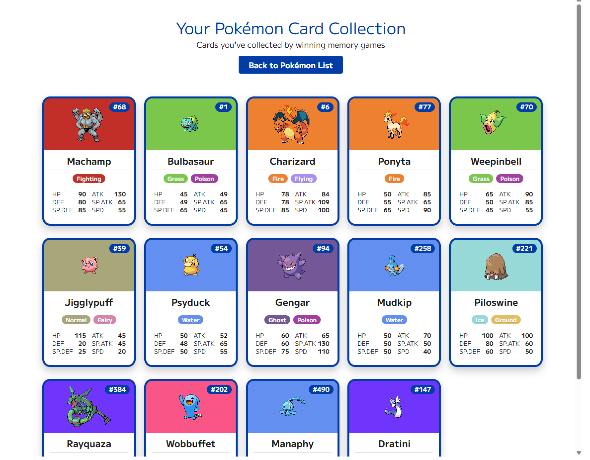

# API

API - Joost Locher - 2025

---

<h2>Week 1</h2>

### Onderzoek

**Content API**

Bij de oefening in de les, waarbij we een web- en content-API moesten zoeken, kwam ik de PokéAPI tegen, en die sprak mij meteen aan. Hierna heb ik nog even verder gekeken, maar ik kwam al snel weer terug bij de PokéAPI. Ik heb hem toen beter geïnspecteerd en ontdekte dat er heel veel data beschikbaar is, en dat je er geen API-key of account voor nodig hebt.

Gekozen API:

- [PokéAPI](https://pokeapi.co/)

Een idee bedenken verliep iets minder soepel, omdat ik te veel aan het nadenken was over hoe ik alle data uit de API kon gebruiken. Maar dit is nogal veel voor de PokéAPI, dus raakte ik een beetje overspoeld. Uiteindelijk heb ik het idee bedacht voor een memory game met Pokémon-sprites, waarbij je alle Pokémon kunt sparen in kaarten met hun stats, die op een aparte pagina te zien zijn.

**Web API**

Voor de web-API had ik een lijst gemaakt met mogelijke web-API’s die ik zou kunnen gebruiken voor mijn memory game. Dit waren:

- Local Storage
- Gamepad
- Canvas
- Gyroscoop (voor telefoon)
- View transition

Na het voortgangsgesprek had ik gekozen voor de Local Storage Web API voor het opslaan van de kaarten wanneer er een game is gewonnen voor een Pokémon of generatie. De andere Web API was de Gyroscoop, om de kaartjes te kunnen bewegen op je mobiel.

Gekozen Web API:

- [Gyroscope](https://developer.mozilla.org/en-US/docs/Web/API/Gyroscope)
- [LocalStorage](https://developer.mozilla.org/en-US/docs/Web/API/Window/localStorage)

### Voortgang

**Setup**

Om te beginnen moesten we het basisproject van GitHub clonen. Ik zat hiervoor in het beginnersgroepje, en het was makkelijk te volgen totdat er een error bij mij opkwam bij het opstarten van de dev. Na veel onderzoek naar waar het probleem lag – door zowel de docent als zelfs ChatGPT – bleek het probleem te liggen aan hoe mijn folder heette waarin het project stond. Mijn folder had ik WD&D genoemd voor de minor, maar bij het opstarten van de dev kon hij blijkbaar niet verder dan deze folder. Dit kwam door het '&'-teken. Nadat ik dit had opgelost door de map een andere naam te geven, verliep de rest soepel.

**Content API**

Om te testen of ik de data uit de API kon halen, heb ik deze eerst gelinkt door de URL te gebruiken. Vervolgens heb ik een array met alle Pokémon kunnen loggen in de console van VSCode. Dit lukte al snel, maar hij haalde nu álle Pokémon op – en dat zijn er nogal veel. Dus had ik de URL aangepast zodat ik een const limit kon toevoegen, waarmee ik alleen de eerste 100 kon ophalen.

De volgende stap voor mij was om te kijken of ik de stats van één specifieke Pokémon kon ophalen en deze weer in de console kon loggen. Dit was even zoeken door alle data heen, maar uiteindelijk is ook dit gelukt.

### Feedback, Vooruitgang & Volgende Week

**Feedback**

- Kijken voor beste api om data op de slaan (cookies, session storage of local storage)

**Vooruitgang**

- Basis opgezet (uit het opzet bestand)
- Content API gebruikt
- Succesvol data tonen in de console

**Volgende Week**

- Eerste data visueel inladen op de pagina
- Idee compleet maken
- Werken aan de styling

### Bronnen & Hulp

- [PokéAPI](https://pokeapi.co/)
- [Gyroscope](https://developer.mozilla.org/en-US/docs/Web/API/Gyroscope)
- [LocalStorage](https://developer.mozilla.org/en-US/docs/Web/API/Window/localStorage)

---

<h2>Week 2</h2>

### Voortgang

**Huisstijl & Layout**

Deze week begon ik met het maken van een huisstijl in Figma en kwam al snel uit op de kleur blauw, wat geassocieerd wordt met geheugen. Verder heb ik een naam/logo bedacht: MEM404. Dit staat voor MEMory en 404 van de “error not found” – een naam die ik zelf grappig vind, omdat je tijdens het spelen van memory soms ook denkt: waar was dit ook alweer?

Daarnaast heb ik heel grof de layout met blokken uitgestippeld, om aan te geven waar ik wat wilde hebben en hoeveel pagina’s ik voor mijn idee nodig had.

**Detail pagina test**

Deze week is het me ook gelukt om de array met Pokémon op de homepagina te zetten, met voor elke Pokémon een link naar de detailpagina. Op die detailpagina stonden vervolgens hun sprite, stats en type.

**Eerst opmaak & Zoek functie**

Als laatste deze week had ik de huisstijl toegevoegd op de homepagina, waar je de Pokémon of generatie kunt kiezen waarmee je de memory game gaat spelen. Hiervoor had ik ook een formulier met een zoekbalk toegevoegd, zodat je snel een specifieke Pokémon kunt zoeken.

Eerst probeerde ik dit te doen met list.js, wat ik al eerder had gebruikt bij het project Tech van CMD, maar het lukte me niet om het werkend te krijgen. Daarom ben ik naar Cyd gestapt, en die heeft me geholpen met een simpelere oplossing, namelijk door dit te gebruiken:<code>const searchResponse = await fetch('https://pokemon-service-ucql.onrender.com/api/v1/pokemon/search?name=' + searchQuery);</code>

### Feedback, Vooruitgang & Volgende Week

**Feedback**

- Search url in plaats van list.js
- Comments toevoegen / Code beter begrijpen
- Focus op 1 ding (pokemon of generatie)

**Vooruitgang**

- Huiststijl & Basis Layout
- Data op de pagina zetten, met bijbehorende detailpagina per Pokémon
- Zoekfunctie toegevoegd aan hoofdscherm

**Volgende Week**

- Memory game opzetten

### Bronnen & Hulp

- Hulp van Cyd

---

<h2>Week 3</h2>

### Voortgang

**Memory game**

Deze week heb ik de memory game voor elkaar gekregen door verschillende sprites voor 1 pokemon op te halen en deze dubbele te maken en aan elkaar linken zodat als je 2 dezelfde hebt omgedraaid dan blijven die vast staan en als je alles goed hebt win je en win je ook een kaart voor die pokemon die in je binder komt te staan. Hiervoor heb ik wel wat hulp gekregen van Claude en heb er zelf wat aangepast. Zo heb ik ook een functie toegevoegd dat je binnen een bepaalde tijd of aantal moves moet winnen om het allemaal wat lastiger te maken. 

**Local Storage**

Voor het opslaan van de cards in de binder heb ik localstorage gebruikt in de client side. Hiervoor had ik wat onderzoek gedaan online en met klein beetje hulp van ai ook werkend gekregen voor wanneer je de game wint.  

### Feedback, Vooruitgang & Volgende Week

**Feedback**
- 2e web api toevoegen
- Online zetten
- Footer weghalen als toch niet gebruikt

**Vooruitgang**
- Memory Game werkend
- Local Storage toegevoegd

**Volgende Week**
- Afronding
- 2e web api toevoegen
- Online zetten

### Bronnen & Hulp

- [LocalStorage](https://developer.mozilla.org/en-US/docs/Web/API/Window/localStorage)
- [Claude](https://claude.ai)

---

<h2>Week 4</h2>

### Onderzoek

**Afronding**

Dit is de laatste week van het project. Aangezien het paasweekend was, en het eindgesprek donderdag is, heb ik een dag de tijd om aan het project te werken. Om deze reden had ik vorige week alle grote functies afgerond en ga ik deze week werken aan mijn documentatie.

### Ontwikkeling

**Afronding**

Naast paar kleine refactorings, heb ik geen grote aanpassingen kunnen maken aan het project.

### Feedback, Vooruitgang & Volgende Week

**Feedback**

**Vooruitgang**

**Volgende Week**

### Bronnen & Hulp

